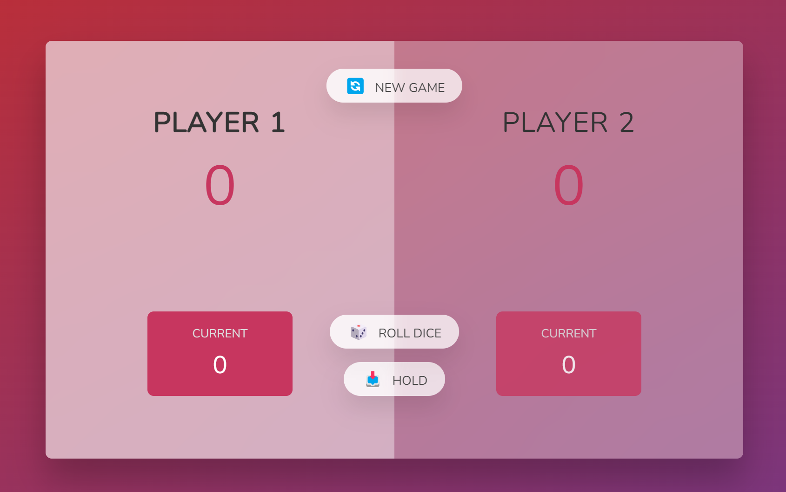

# 🕹️ Pig game

 
Section 7 - Lesson 82 Project #3 Pig game
  

---

### Rule of the game: 

🎲 Click on a roll the dice and if it is not the number 1:
you get this score added to your current score, 
⚠️ but if it is the number 1
it will switch the player and you lose all your points. 
✋🏻You can use the hold option, which will switch the player but save your points.  
🎉 Win who gets the first 100 points. 
😭 Lose if you get score more than 100 points.

---

### Links

- Live Site URL: [Click here](https://ciisiq.github.io/studying-Pig-Game/)

---

### What I learned

- Manipulation of the DOM on JavaScript
- How to random number in JS
- How to remove and add class

---

### Result Screenshot

  
